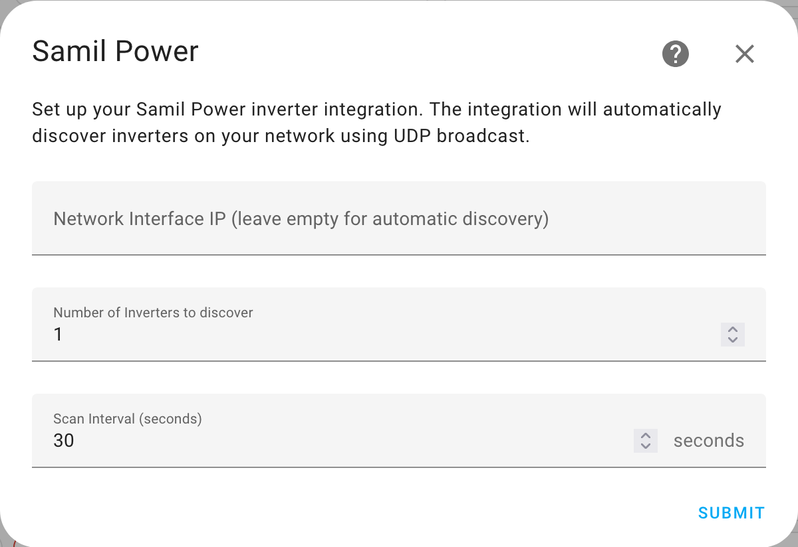
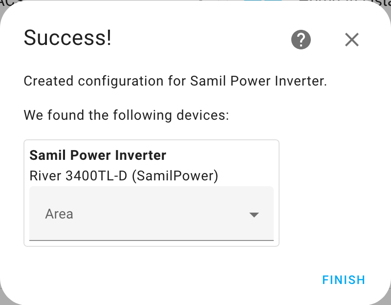
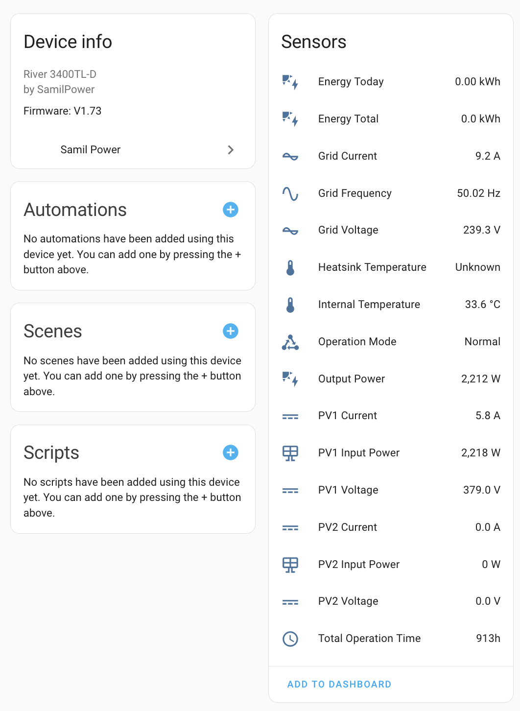

# Home Assistant Integration for Samil Power Inverters

This is a **custom Home Assistant integration** based on the [Solar project](https://github.com/mhvis/solar/) by [mhvis](https://github.com/mhvis). This integration extends the functionality of the original Solar project, making it compatible as a Home Assistant custom component.

## Credits
This integration is **heavily based on the work** of [mhvis](https://github.com/mhvis) and the original [Solar project](https://github.com/mhvis/solar/). A huge thanks for making this project possible!

## Supported inverter series

* SolarRiver TL-D
* SolarLake TL
* (Maybe also SolarRiver TL but probably not)

## Features
- Provides real-time solar energy monitoring
- Seamless integration with Home Assistant
- Supports automatic discovery via UDP broadcast
- Custom sensors for tracking solar performance

## Installation
### Manual Installation
1. Download the latest release from this repository.
2. Copy the `custom_components/solar` directory into your Home Assistant `custom_components` folder.
3. Restart Home Assistant.

### HACS Installation (Recommended)
1. Add this repository as a **custom repository** in [HACS](https://hacs.xyz/):
   - Go to HACS → Integrations → Three dots (top-right) → Custom repositories.
   - Enter this repository URL and select **Integration**.
   - Click **Add**.
2. Search for `Solar` in HACS and install it.
3. Restart Home Assistant.

## Configuration
After installation, go to **Settings → Devices & Services → Add Integration** and search for `Solar`. You can either manually enter your inverter's IP address or leave it blank to allow automatic discovery via UDP broadcast.

### Adding the integration

### (Hopefully) found your device

### Device settings

## Contributing
Feel free to open issues or submit pull requests to improve this integration.

## License
This project follows the same license as the original [Solar project](https://github.com/mhvis/solar/).